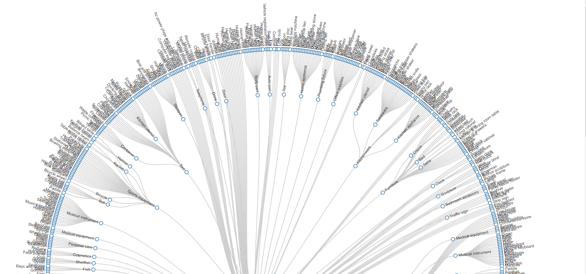
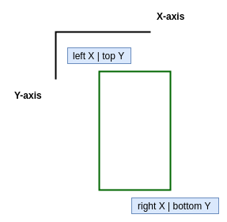
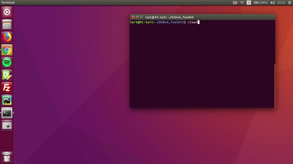

<h1> Forked repository and added conversion python script </h1>
My added script is: 
<strong>convert_annotations.py</strong>

Use toolkit normally to gather images from open images dataset. After gathering images just run from root directory:
```bash
python convert_annotations.py
```
This will generate .txt annotation files in proper format for custom object detection with YOLOv3. The text files are generated in folder with images.

<h1 align="center"> ~ OIDv4 ToolKit ~ </h1>

Do you want to build your personal object detector but you don't have enough images to train your model? Do you want to train your personal image classifier, but you are tired of the deadly slowness of ImageNet? Have you already discovered [Open Images Dataset v4](https://storage.googleapis.com/openimages/web/index.html) that has [600](https://storage.googleapis.com/openimages/2018_04/bbox_labels_600_hierarchy_visualizer/circle.html) classes and more than 1,700,000 images with related bounding boxes ready to use? Do you want to exploit it for your projects but you don't want to download gigabytes and gigabytes of data!?

With this repository we can help you to get the best of this dataset with less effort as possible.
In particular, with this practical ToolKit written in Python3 we give you, for both object detection and image classification tasks, the following options:

**(2.0) Object Detection**

* download any of the [600](https://storage.googleapis.com/openimages/2018_04/bbox_labels_600_hierarchy_visualizer/circle.html) classes of the dataset individually, taking care of creating the related bounding boxes for each downloaded image
* download multiple classes at the same time creating separated folder and bounding boxes for each of them
* download multiple classes and creating a common folder for all of them with a unique annotation file of each image
* download a single class or multiple classes with the desired [attributes](https://storage.googleapis.com/openimages/web/download.html)
* use the practical visualizer to inspect the donwloaded classes

**(3.0) Image Classification**

* download any of the [19,794](https://storage.googleapis.com/openimages/web/download.html#attributes) classes in a common labeled folder
* exploit tens of possible commands to select only the desired images (ex. like only test images)

The code is quite documented and designed to be easy to extend and improve.
Me and [Angelo](https://github.com/keldrom) are pleased if our little bit of code can help you with your project and research. Enjoy ;)



# Open Image Dataset v4
All the information related to this huge dataset can be found [here](https://storage.googleapis.com/openimages/web/index.html).
In these few lines are simply summarized some statistics and important tips.

**Object Detection**

<table>
    <tr><td></td><td><b>Train<b></td><td><b>Validation<b></td><td><b>Test<b></td><td><b>#Classes<b></td></tr>
    <tr><td>Images</td><td>1,743,042</td><td>41,620	</td><td>125,436</td><td>-</td></tr>
    <tr><td>Boxes</td><td>14,610,229</td><td>204,621</td><td>625,282</td><td>600</td></tr>
</table>

**Image Classification**

<table>
    <tr><td></td><td><b>Train<b></td><td><b>Validation<b></td><td><b>Test<b></td><td><b>#Classes<b></td></tr>
    <tr><td>Images</td><td>9,011,219</td><td>41,620</td><td>125,436</td><td>-</td></tr>
    <tr><td>Machine-Generated Labels</td><td>78,977,695</td><td>512,093</td><td>1,545,835</td><td>7,870</td></tr>
    <tr><td>Human-Verified Labels</td><td>27,894,289</td><td>551,390</td><td>1,667,399</td><td>19,794</td></tr>
</table>

As it's possible to observe from the previous table we can have access to images from free different groups: train, validation and test.
The ToolKit provides a way to select only a specific group where to search.
Regarding object detection, it's important to underline that some annotations has been done as a group. It means that a single bounding box groups more than one istance. As mentioned by the creator of the dataset:
- **IsGroupOf**: Indicates that the box spans a group of objects (e.g., a bed of flowers or a crowd of people). We asked annotators to use this tag for cases with more than 5 instances which are heavily occluding each other and are physically touching.
That's again an option of the ToolKit that can be used to only grasp the desired images.

Finally, it's interesting to notice that not all annotations has been produced by humans, but the creator also exploited an enhanced version of the method shown here reported [1](#reference)

# 1.0 Getting Started

## 1.1 Installation

Python3 is required.

1. Clone this repository
   ```bash
   git clone https://github.com/EscVM/OIDv4_ToolKit.git
   ```
2. Install the required packages
   ```bash
   pip3 install -r requirements.txt
   ```
Peek inside the requirements file if you have everything already installed. Most of the dependencies are common libraries.

## 1.2 Launch the ToolKit to check the available options
First of all, if you simply want a quick reminder of al the possible options given by the script, you can simply launch, from your console of choice, the [main.py](main.py). Remember to point always at the main directory of the project
   ```bash
   python3 main.py
   ```
or in the following way to get more information
   ```bash
   python3 main.py -h
   ```

# 2.0 Use the ToolKit to download images for Object Detection
The ToolKit permit the download of your dataset in the folder you want (`Dataset`as default). The folder can be imposed with the argument
`--Dataset` so you can make different dataset with different options inside.

As previously mentioned, there are different available options that can be exploited. Let's see some of them.

## 2.1 Download different classes in separated folders
Firstly, the ToolKit can be used to download classes in separated folders. The argument `--classes` accepts a list of classes or
the path to the file.txt (`--classes path/to/file.txt`) that contains the list of all classes one for each lines (classes.txt uploaded as example).

**Note**: for classes that are composed by different
words please use the `_` character instead of the space (only for the inline use of the argument `--classes`).
Example: `Polar_bear`.

Let's for example download Apples and Oranges from the validation set. In this case we have to use the following command.
  ```bash
   python3 main.py downloader --classes Apple Orange --type_csv validation
   ```
The algorith will take care to download all the necessary files and build the directory structure like this:

```
main_folder
│   main.py
│
└───OID
    │   file011.txt
    │   file012.txt
    │
    └───csv_folder
    |    │   class-descriptions-boxable.csv
    |    │   validation-annotations-bbox.csv
    |
    └───Dataset
        |
        └─── test
        |
        └─── train
        |
        └─── validation
             |
             └───Apple
             |     |
             |     |0fdea8a716155a8e.jpg
             |     |2fe4f21e409f0a56.jpg
             |     |...
             |     └───Labels
             |            |
             |            |0fdea8a716155a8e.txt
             |            |2fe4f21e409f0a56.txt
             |            |...
             |
             └───Orange
                   |
                   |0b6f22bf3b586889.jpg
                   |0baea327f06f8afb.jpg
                   |...
                   └───Labels
                          |
                          |0b6f22bf3b586889.txt
                          |0baea327f06f8afb.txt
                          |...
```
If you have already downloaded the different csv files you can simply put them in the `csv_folder`. The script takes automatically care of the download of these files, but if you want to manually download them for whatever reason [here](https://storage.googleapis.com/openimages/web/download.html) you can find them.

If you interupt the downloading script `ctrl+d` you can always restart it from the last image downloaded.

## 2.2 Download multiple classes in a common folder
This option allows to download more classes, but in a common folder. Also the related notations are mixed together with
 the already explained format (the first element is always the name of the single class). In this way, with a simple
 dictionary it's easy to parse the generated label to get the desired format.

Again if we want to download Apple and Oranges, but in a common folder
  ```bash
   python3 main.py downloader --classes Apple Orange --type_csv validation --multiclasses 1
   ```

### Annotations



In the __original__ dataset the coordinates of the bounding boxes are made in the following way:

**XMin**, **XMax**, **YMin**, **YMax**: coordinates of the box, in normalized image coordinates. XMin is in [0,1], where 0 is the leftmost pixel, and 1 is the rightmost pixel in the image. Y coordinates go from the top pixel (0) to the bottom pixel (1).

However, in order to accomodate a more intuitive representation and give the maximum flexibility, every `.txt` annotation is made like:

`name_of_the_class    left    top     right     bottom`

where each coordinate is denormalized. So, the four different values correspond to the actual number of pixels of the related image.

If you don't need the labels creation use `--noLabels`.

### Optional Arguments
The annotations of the dataset has been marked with a bunch of boolean values. This attributes are reported below:
- **IsOccluded**: Indicates that the object is occluded by another object in the image.
- **IsTruncated**: Indicates that the object extends beyond the boundary of the image.
- **IsGroupOf**: Indicates that the box spans a group of objects (e.g., a bed of flowers or a crowd of people). We asked annotators to use this tag for cases with more than 5 instances which are heavily occluding each other and are physically touching.
- **IsDepiction**: Indicates that the object is a depiction (e.g., a cartoon or drawing of the object, not a real physical instance).
- **IsInside**: Indicates a picture taken from the inside of the object (e.g., a car interior or inside of a building).
- **n_threads**: Select how many threads you want to use. The ToolKit will take care for you to download multiple images in parallel, considerably speeding up the downloading process.
- **limit**: Limit the number of images being downloaded. Useful if you want to restrict the size of your dataset.
- **y**: Answer yes when have to download missing csv files.

Naturally, the ToolKit provides the same options as paramenters in order to filter the downloaded images.
For example, with:
  ```bash
   python3 main.py downloader -y --classes Apple Orange --type_csv validation --image_IsGroupOf 0
   ```
only images without group annotations are downloaded.

# 3.0 Download images from Image-Level Labels Dataset for Image Classifiction
The Toolkit is now able to acess also to the huge dataset without bounding boxes. This dataset is formed by 19,995 classes and it's already divided into train, validation and test. The command used for the download from this dataset is ```downloader_ill``` (Downloader of Image-Level Labels) and requires the argument ```--sub```. This argument selects the sub-dataset between human-verified labels ```h``` (5,655,108 images) and machine-generated labels ```m``` (8,853,429 images). An example of command is:
```bash
python3 main.py downloader_ill --sub m --classes Orange --type_csv train --limit 30
```
The previously explained commands ```Dataset```, ```multiclasses```, ```n_threads``` and ```limit``` are available.
The Toolkit automatically will put the dataset and the csv folder in specific folders that are renamed with a `_nl` at the end.
# Commands sum-up

|                    | downloader | visualizer | downloader_ill |                                                  |
|-------------------:|:----------:|:----------:|:--------------:|--------------------------------------------------|
|            Dataset |      O     |      O     |        O       | Dataset folder name                              |
|            classes |      R     |            |        R       | Considered classes                               |
|           type_csv |      R     |            |        R       | Train, test or validation dataset                |
|                  y |      O     |            |        O       | Answer yes when downloading missing csv files    |
|       multiclasses |      O     |            |        O       | Download classes toghether                       |
|           noLabels |      O     |            |                | Don't create labels                              |
|   Image_IsOccluded |      O     |            |                | Consider or not this filter                      |
|  Image_IsTruncated |      O     |            |                | Consider or not this filter                      |
|    Image_IsGroupOf |      O     |            |                | Consider or not this filter                      |
|  Image_IsDepiction |      O     |            |                | Consider or not this filter                      |
|     Image_IsInside |      O     |            |                | Consider or not this filter                      |
|          n_threads |      O     |            |        O       | Indicates the maximum threads number             |
|              limit |      O     |            |        O       | Max number of images to download                 |
|                sub |            |            |        R       | Human-verified or Machine-generated images (h/m) |

R = required, O = optional

# 4.0 Use the ToolKit to visualize the labeled images
The ToolKit is useful also for visualize the downloaded images with the respective labels.
```bash
   python3 main.py visualizer
   ```
  In this way the default `Dataset` folder will be pointed to search the images and labels automatically. To point
  another folder it's possible to use `--Dataset` optional argument.
```bash
   python3 main.py visualizer --Dataset desired_folder
   ```
Then the system will ask you which folder to visualize (train, validation or test) and the desired class.
Hence with `d` (next), `a` (previous) and `q` (exit) you will be able to explore all the images. Follow the menu for all the other options.

<p align="center">
  
</p>

# 5.0 Community Contributions
- [Denis Zuenko](https://github.com/zuenko) has added multithreading to the ToolKit and is currently working on the generalization and speeding up process of the labels creation
- [Skylion007](https://github.com/Skylion007) has improved labels creation reducing the runtime from O(nm) to O(n). That massively speeds up label generation
- [Alex March](https://github.com/hosaka) has added the limit option to the ToolKit in order to download only a maximum number of images of a certain class
- [Michael Baroody](https://github.com/mbaroody) has fixed the toolkit's visualizer for multiword classes

# Citation
Use this bibtex if you want to cite this repository:
```
@misc{OIDv4_ToolKit,
  title={Toolkit to download and visualize single or multiple classes from the huge Open Images v4 dataset},
  author={Vittorio, Angelo},
  year={2018},
  publisher={Github},
  journal={GitHub repository},
  howpublished={\url{https://github.com/EscVM/OIDv4_ToolKit}},
}
```

# Reference
"[We don't need no bounding-boxes: Training object class detectors using only human verification](https://arxiv.org/abs/1602.08405)"Papadopolous et al., CVPR 2016.
